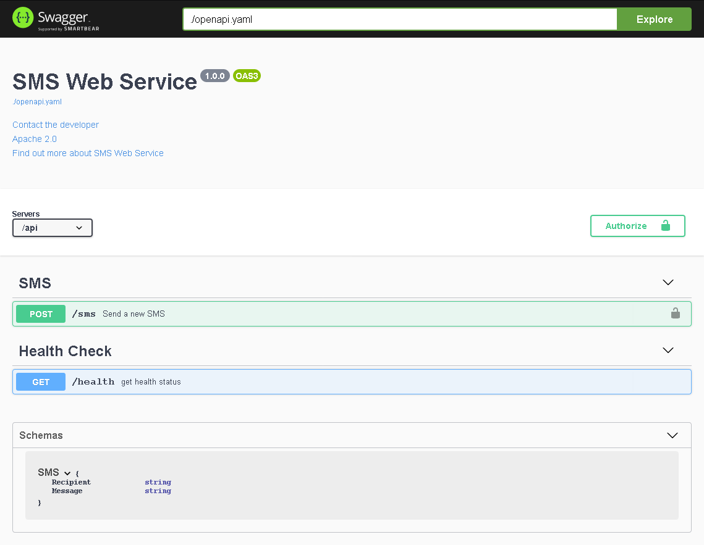
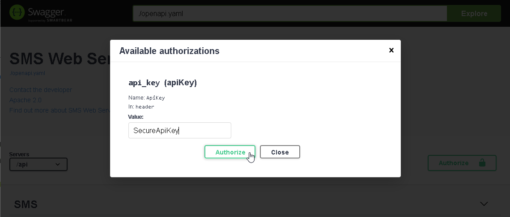

# SMS Web Service

Turn your Android phone into a SMS Gateway.

Send and receive SMS through your android phone using RestFUL Web service.

EmbedIO 2.0, https://github.com/unosquare/embedio/tree/v2.X

Open Api 3, https://www.openapis.org/

Swagger UI 3, https://swagger.io/tools/swagger-ui/

http://[Phone IP Address]:8767

Default ApiKey is "SecureApiKey"

Release: 
